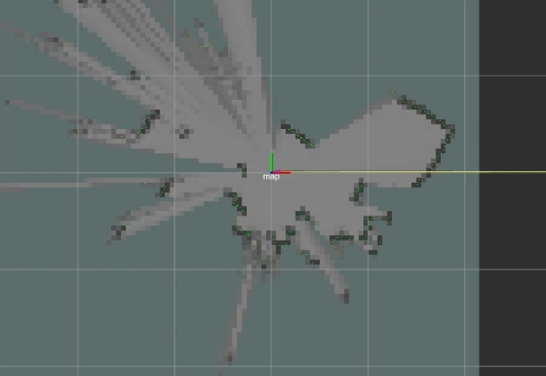
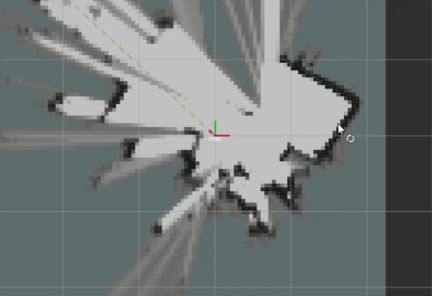

# Autonomous-Navigation-Implementation-with-ROS-2-TurtleBot3

https://youtu.be/KPBEK3a9VVg

การนำหุ่นยนต์ TurtleBot3 Burger มาพัฒนาต่อด้วย ROS 2 Humble
ซึ่งสามารถทำการสร้างแผนที่ (SLAM) และ การนำทางอัตโนมัติ (Autonomous Navigation)

กำหนดการสื่อสารกันระหว่าง Raspberry Pi 4 และ Remote PC (Virtual Box) 
ผ่านเครือข่าย WIFI เดียวกัน โดยใช้เทคโนโลยี DDS

SLAM Mapping: ใช้ Cartographer ในการสร้าง Occupancy Grid Map ของพื้นที่ทดสอบ

Hardware & Software Stack
 - Robot: TurtleBot3 Burger (SBC: Raspberry Pi 4, Controller: OpenCR)

 - Sensor: 360 Laser Distance Sensor (LDS-01)

 - OS: Ubuntu 22.04 LTS

 - ROS Version: ROS 2 Humble Hawksbill

เนื่องจากไม่มีแบตเตอรี่ และจ่ายไฟผ่าน Adaptor เท่านั้น จึงไม่ได้ทำ SLAM ไกลแต่ก็เห็นผลลัพธ์ว่าแผนที่ได้เพิ่มพื้นที่มากขึ้น

  
  

หลังจากที่ได้แบตเตอรี่มาแล้ววีดีโอด้านล่างนี้ทำ Nav2 ไปยังตำแหน่ง พื้นที่สีขาวได้

